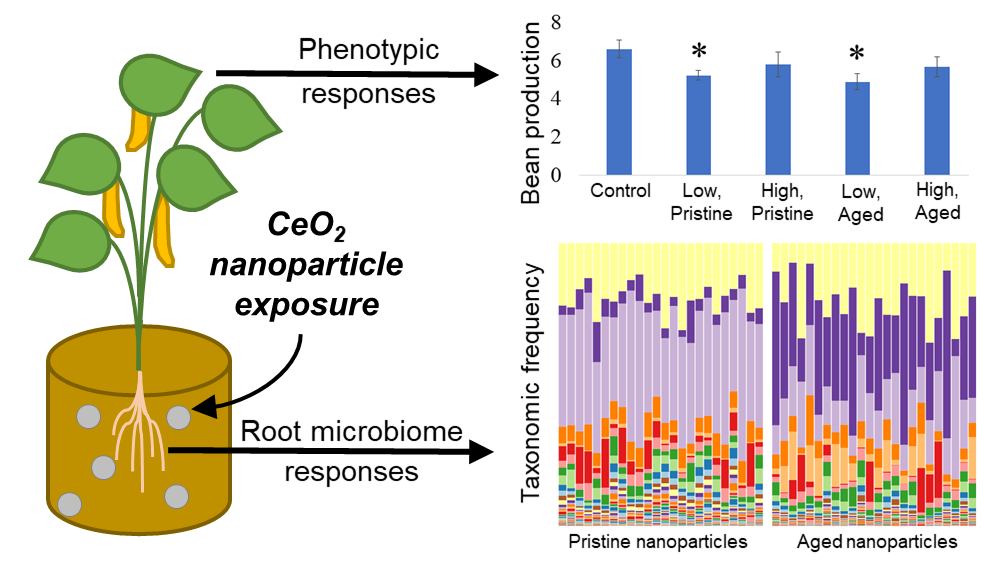

# Matt's Portfolio
Collection of projects related to data science

# [PhD Dissertation](https://github.com/mattslatt/personal_portfolio/tree/main/dissertation)
* Compared toxic profiles using logistic regressions
* Classified and clustered >20 million bacteria with Naive Bayes, PCA, and KNN models

# [Project 1: Music Genre Analysis](https://github.com/mattslatt/spotify)
* Merged data from 2.1 million artists and 500k songs to generate time-series data for hypothesis testing
* Engineered novel features to recommend relatively unknown artists according to user input
* Combined Random Forest and KNN models to predict a song’s genre based on features called from Spotify’s API

# [Project 2: Podcast Topic Mining](https://github.com/mattslatt/podcast_reviews)
* Cleaned and vectorized 1.2 million podcast reviews to train Naive Bayes and SVM models for sentiment prediction, optimized for F1 score with minority class oversampling
* Highlighted podcast topics most likely to incur positive or negative audience responses based on text feature importance

# [Project 3: Fraudulent Transaction Detection](https://github.com/mattslatt/podcast_reviews)
* Collaborated with three peers to build and deploy an XGBoost model that flags fraudulent charges based on transaction metadata
* Engineered location-based features and resolved missing data by imputing values with linear regression to boost model performance