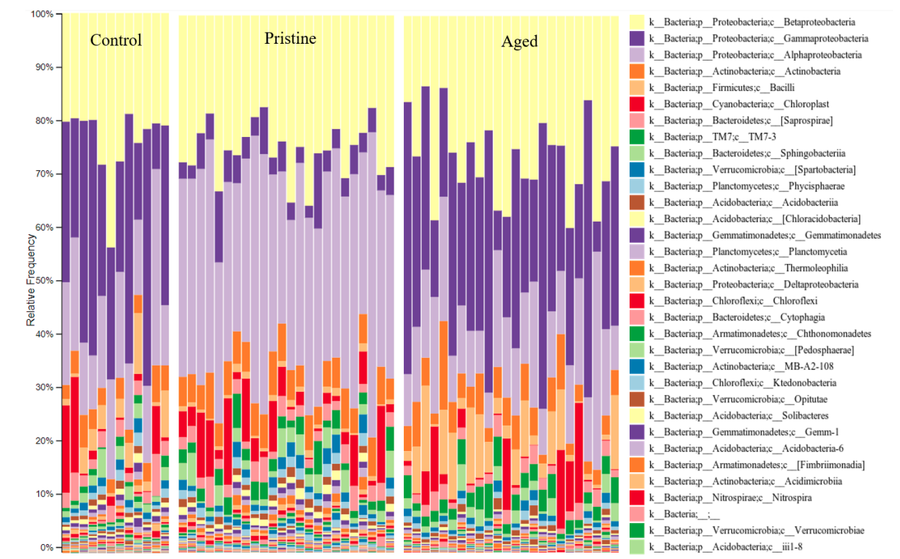

# Data Science Projects
Collection of research and projects related to machine learning and statistical analysis

# [PhD Dissertation](https://github.com/mattslatt/personal_portfolio/tree/main/dissertation)
* Investigated environmental responses to nanoparticle exposures using a mix of old-school and state-of-the-art toxicology techniques
* Classified and clustered >20 million bacteria with Naive Bayes, PCA, and KNN techniques to reveal data trends
* Compared toxic profiles using logistic regressions to draw conclusions about pesticide products

# [Project: Podcast Topic Mining](https://github.com/mattslatt/podcast_reviews)
* Cleaned and vectorized 1.2 million podcast reviews to train Naive Bayes and SVM models for sentiment prediction, optimized for F1 score with minority class oversampling
* Highlighted podcast topics most likely to incur positive or negative audience responses based on text feature importance

