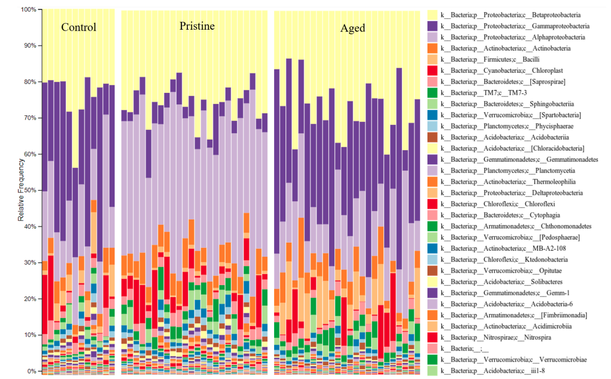
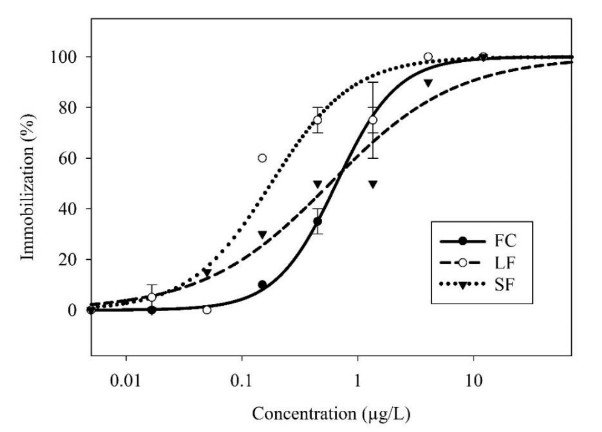

# PhD Dissertation
Here you can download my dissertation, as well as interactive figures (under /visualizations) that interface with the [QIIME2 artifact viewer](https://view.qiime2.org/).

The main thesis of my work explored how nanoparticle size influences toxicity.

# Visual summary

## Comparing the bacterial diversity (Observed OTUs) of three spatial commpartments (rhizosphere, rhizoplane, root)

## Logistic regressions model toxic profiles of various pesticides

## Logistic regressions model toxic profiles of various pesticides

