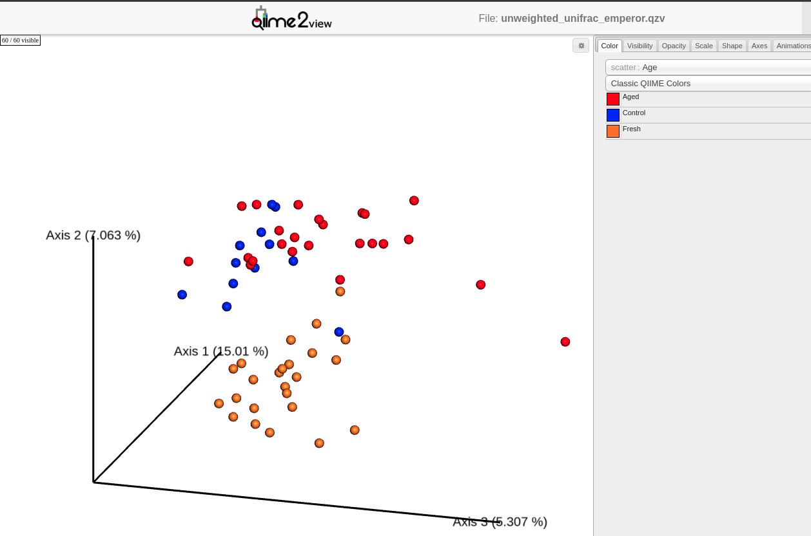

# PhD Dissertation
Here you can download my dissertation, as well as interactive visualizations (under /visualizations) that interface with the [QIIME2 artifact viewer](https://view.qiime2.org/).

# Summary
In case you don't feel like reading 140 pages of toxicology research:
* Humans accidentaly pollute the environment with nanoparticles
* Modeling nanoparticle toxicity helps us reduce environmental harm
* Nanoparticle size is an important feature when modeling toxicity

Below are a few figures that showcase a bit of my work.

## Naive Bayes classification of >20 million bacteria
Control, Pristine, and Aged are the three different nanoparticle treatments I exposed plants to. The graphs are visual representations of the types of bacteria that thrived in those treatments.

## Statistical analysis of bacterial diversity in three spatial commpartments
In addition to classifying tens of millions of bacteria, I also conducted a statistical analysis on how different bacterial communities were across three spatial compartments (the Rhizosphere, Rhizoplane, and Root). 

## Logistic regression models predict pesticide toxicity
Logistic regressions like these allow for the calculation of LD50's (lethal doses which kill 50% of the population) and facilitate statistical comparison of toxicity.

## Screenshot of interactive QIIME2 visualization
If you download the .qzv files in the visualizations folder, you can interact with 3-dimenional PCA plots via the [QIIME2 artifact viewer](https://view.qiime2.org/) in your web browser. Very nifty and useful tool.

