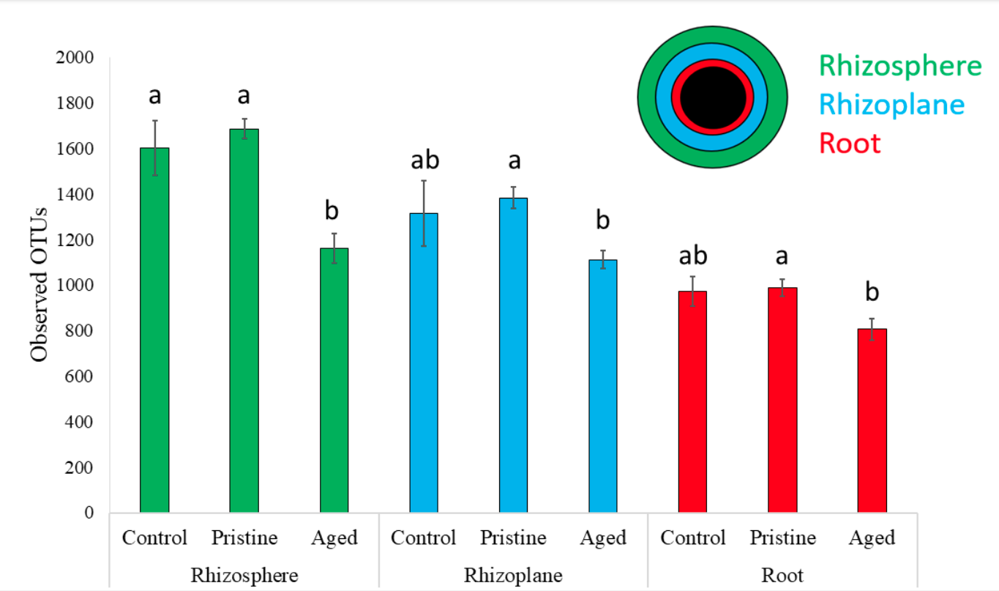

# PhD Dissertation
Here you can download my dissertation, as well as interactive visualizations (under /visualizations) that interface with the [QIIME2 artifact viewer](https://view.qiime2.org/).

# Summary
In case you don't feel like reading 140 pages of toxicology research:
* Humans accidentaly pollute the environment with nanoparticles
* Modeling nanoparticle toxixity is vital to mitigating environmental harm
* Nanoparticle size is an important feature when modeling toxicity

Below are a few figures that showcase a fraction of my work.

## Naive Bayes classification of >20 million bacteria

## Statistical analysis of bacterial diversity in three spatial commpartments

## Logistic regression models predict pesticide toxicity

## Screenshot of interactive QIIME2 visualization -- simply download .qzv's and visit the QIIME2 artifact viewer
