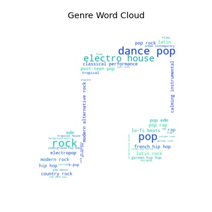

# Spotify Genre Analysis

## Objective
The musical world is a dynamic, evolving system. To help orient ourselves to the massive expanse of music, we use genres as a multiclass label to classify songs and characterize our taste. Some of these genres have been around for decades, while others are only just emerging. 

Understading how music changes over time is useful for artists seeking success, industry professionals on the hunt for fresh talent, and listeners who want to better understand their own musical inclinations.

* How has music changed since our earliest available recordings in the early 20th century?
* Is music within a genre consistent across time?
* Can we use Spotify's algorithmically generated acoustic features to classify a genres?

## Dataset
* 1.1 million artists with genre tags, popularity scores, and other features
* 586k songs with track 11 acoustic features (danceability, energy, acousticness, speechieness, etc.)

## Exploratory Data Analysis
There are more than 5k unique genres, most of which are associated with fewer than 100 artists. Dance pop, pop, rock, electro house, and classical performance are frequently tagged genres (460 to 580 artists), whereas mazandarani folk and swazi traditional are extremely rare (just 1 or 2 tagged artists).

 

This sample of tracks from the Spotify library skews in favor of recent releases, which is probably reflective of a genuine increase in annual song releases related to the  natural growth of the music industry.

Let's take a peek at some of the algorithically generated song features that Spotify provides. Features like 'acousticness' and 'energy' appear to drift over time whereas 'liveness' and others are stable (there are 8 other featuers not shown to improve clarity of the figure). The elevated variance in average scores prior to 1950 is probably due to the reduced number of songs released those years.

What about specific genres? Let's take a look at rock music. Notice the outliers prior to 1950, and increased noise in the data until 1970. This tracks with what you might expect as a genre coalesces into a distinct sound.

From 1970 to 1990, acousticness and energy appear to undergo substantial shifts. This tracks with the popularization of the electric guitar and interest in louder, more aggressive musical expression that plateaued by the 1990s.

## Hypothesis testing
Let's take a peek at how rock music appears to have changed from 1970 to 1990. Were those changes in song features statistically significant? By calculating the annual difference in each score, we can visulize the change more directly and perform a 2-sided t-test on those differences to see if they are significantly different from 0.

H0: Annual differences in the song features are equal to 0

HA: Annual differences in the song features nre not equal to 0

* danceability p-value: 0.882
* energy p-value: 0.078
* acousticness p-value: 0.038

We reject the null hypothesis for acousticness, indicating a statistically meaningful differnce over time. We fail to reject the null hypothesis for danceability and energy.

## Classifying genres
After processing and merging the track and artist datasets, we have 28 genres that are labeled with at least 10k tracks. Let's use an unsupervised clustering method to look for natural groupings of these popular genres.