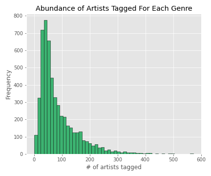

# Spotify Genre Analysis

## Summary
* Exploration and viusualization of trends in music genres on Spotify
* Genre predictor and recommender to for musicophiles to find fresh artists

## Dataset
* 1.1 million artists with genre tags, popularity scores, and other features
* 500k songs with track 11 acoustic features (danceability, acousticness, energy, etc.)

## EDA
* 5k unique genres, most of which are associated with fewer than 100 artists

* Dance pop, pop, rock, electro house, and classical performance are the most common artist genres in the dataset

