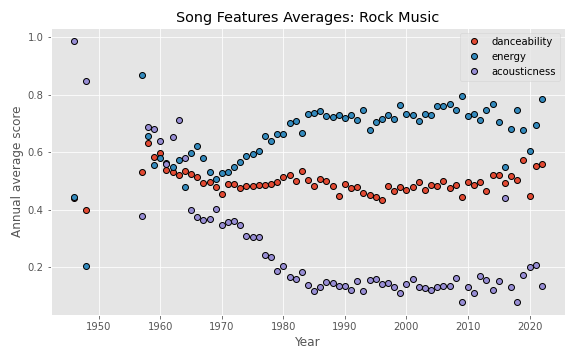

# Spotify Genre Analysis

## Objective
The musical world is a dynamic, evolving system. To help orient ourselves to the massive expanse of music, we use genres as a multiclass label to classify songs and characterize our taste. Some of these genres have been around for decades, while others are only just emerging. 

Understading how music changes over time is useful for artists seeking success, industry professionals on the hunt for fresh talent, and listeners who want to better understand their own musical inclinations.

* How has music changed since our earliest available recordings in the early 20th century?
* Is music within a genre consistent across time?
* Can we use Spotify's algorithmically generated acoustic features to classify a genres?

## Dataset
* 1.1 million artists with genre tags, popularity scores, and other features
* 586k songs with track 11 acoustic features (danceability, energy, acousticness, speechieness, etc.)

## Exploratory Data Analysis
There are more than 5k unique genres, most of which are associated with fewer than 100 artists. Dance pop, pop, rock, electro house, and classical performance are the most common artist genres in the dataset, whereas 

 

Song release dates skew heavily in favor of recent releases. There's a drop around 2000, which is likely a sampling artifact. Only half of the final year (2021) was sampled.

Across all genres, features like 'acousticness' and 'energy' appear to drift over time whereas 'liveness' and others are stable (there are 8 other featuers not shown to improve clarify of the figure). The elevated variance prior to the 1960s is exacerbated by the reduced number of songs released in that period.

What about specific genres? Let's take a look at rock music. To combine artist genre tags with song features, we have to merge the datasets. This assumes some homogeneity in the genre of any given artist's songs.

Notice how 'acousticness' is declines while 'energy' increases from the late 1950's (around the birth of rock) then stabilizes in the 1980s. This tracks with the popularization of the electric guitar and popular interest in louder, more aggressive musical expression that plateaued by the 1990s.

## Hypothesis testing
Do the statistics agree with our visual comparisons 

Let's look at how music has changed in the last 50 years. We can take the year-by-year differences to run hypothesis tests on our song features.

Two-sided t-tests indicate that there is a significant annual difference in 'danceability' (p=0.008) and 'acousticness' (p=0.029). Annual differences in 'energy' are not significantly different from 0 (p=0.128).
