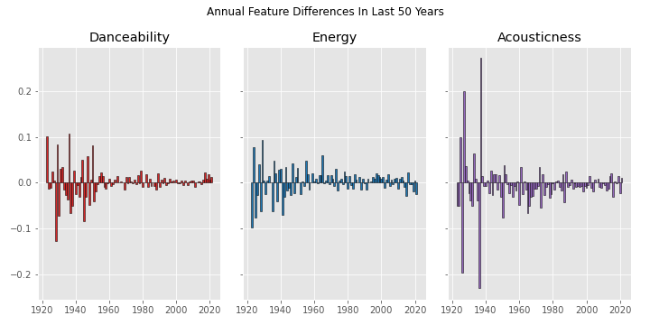

# Spotify Genre Analysis

## Summary
* Exploration and viusualization of trends in music genres on Spotify
* Genre predictor and recommender to for musicophiles to find fresh artists

## Dataset
* 1.1 million artists with genre tags, popularity scores, and other features
* 586k songs with track 11 acoustic features (danceability, acousticness, energy, etc.)

## Exploratory Data Analysis
5k unique genres, most of which are associated with fewer than 100 artists. Dance pop, pop, rock, electro house, and classical performance are the most common artist genres in the dataset

 

Across all genres, features like 'acousticness' and 'energy' appear to drift over time whereas 'liveness' and others are stable

Some genres, like 'rock' have distinctive trends

## Hypothesis testing
Let's look at how music has changed in the last 50 years. We can take the year-by-year differences to run hypothesis tests on our song features.

Two-sided t-tests indicate that there is a significant annual difference in 'danceability' (p=0.008) and 'acousticness' (p=0.029). Annual differences in 'energy' are not significantly different from 0 (p=0.128).
